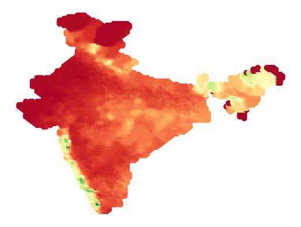
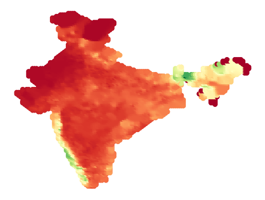

<h1>Indian-RainfallAnalysis</h1>
<h3>
normally in india we have rain fall information from rain gauges in every 1 degree lat and long.By using deep learning we are trying to achive rainfall data for every 0.25 degreee of lat and long</h3>
<h3>
methods used:
i) moving weighted avg(commenly used for temprature predicition
ii)auto encoder decoder model- here our aim is  passing a low resulution image and getting a better reslution image
</h3>

  

  

1 degree rainfall image &nbsp;&nbsp;&nbsp;&nbsp;&nbsp;&nbsp;&nbsp;&nbsp;&nbsp;&nbsp;&nbsp;&nbsp;&nbsp;&nbsp;&nbsp;&nbsp;&nbsp;&nbsp;&nbsp;&nbsp;&nbsp;&nbsp;&nbsp;&nbsp;&nbsp;&nbsp;&nbsp;&nbsp;&nbsp;&nbsp;&nbsp;&nbsp;&nbsp;&nbsp;&nbsp;&nbsp;&nbsp;&nbsp;&nbsp;&nbsp;0.25 degree rainfall image

